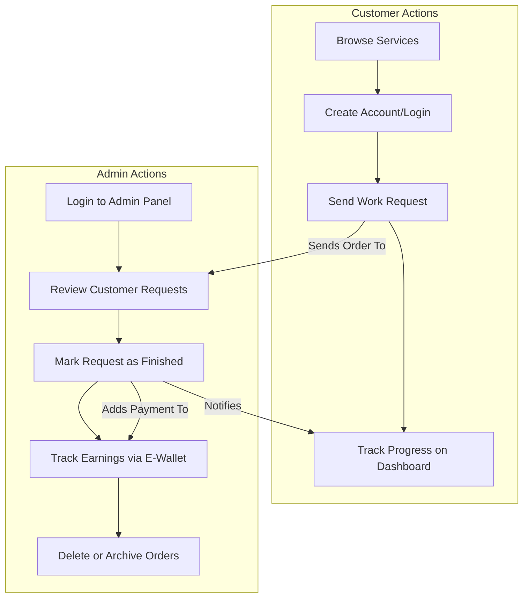
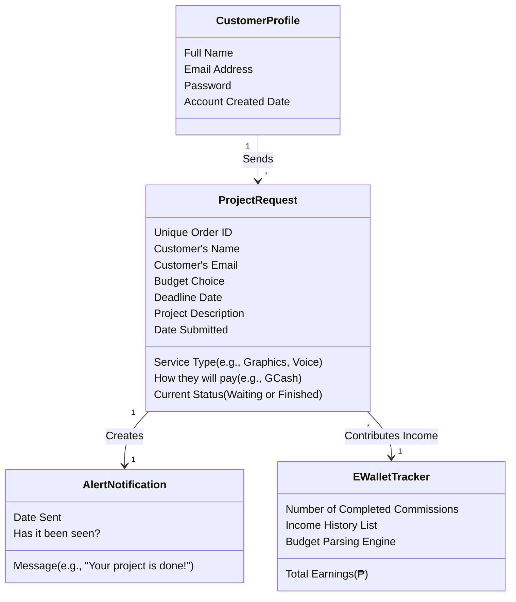
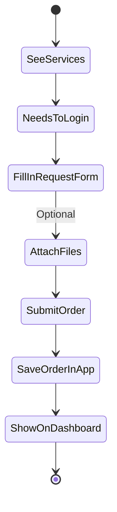
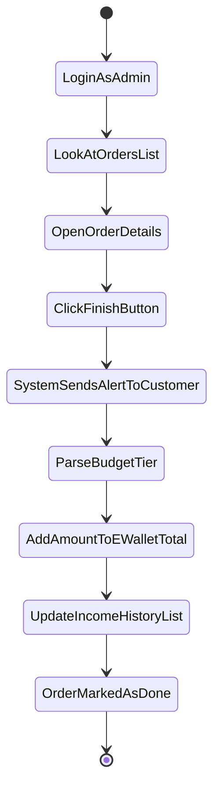

# CommissionHub — Simplified System Design

This document explains how the CommissionHub app works using simple language that everyone can understand. It avoids technical code and focuses on the people using the app and the information being handled.

---

## 1. System Requirements (What the App Does)
The app is a bridge between a person who needs creative work done (the **Customer**) and a professional who provides services (the **Admin**).

*   **For Customers:** It allows them to see what services are offered, create an account, and fill out a form to request a project. They can also see when their project is finished.
*   **For the Admin:** It provides a private dashboard to see all incoming requests, organize them, mark them as done, or remove old ones. **It also features an E-Wallet tracker to automatically sum up total earnings from all completed projects.**
*   **Information Storage:** The app remembers who you are, what you requested, and all historical income data (processed through budget tier parsing) so you don't lose your progress.

---

## 2. System Actors (Who Uses the App)

| Who they are | What they do in the App |
|---|---|
| **Customer (Client)** | Browses the services, creates a personal account, sends detailed project requests, and waits for updates on their dashboard. |
| **Administrator (Worker)** | Logs into a private panel to see all requests. They review what the customer wants, mark orders as "Completed" when the work is done, manage the overall list, and **monitor financial growth through the E-Wallet interface.** |
| **The System (App)** | Automatically saves data, sends alerts when work is finished, and makes sure the right information is shown to the right person. |

---

## 3. Top Use Cases (How People Use the App)

This diagram shows how different actions connect the Customer and the Admin through the App.

---

## 4. Class Diagram (The Information Held)

This diagram shows the main "objects" or boxes of information the app keeps track of and what details (attributes) are inside them.

---

## 5. Activity Diagrams (Step-by-Step Flows)

### 5.1 Ordering a Service (The Customer's Journey)

### 5.2 Finishing a Request (The Admin's Journey)

