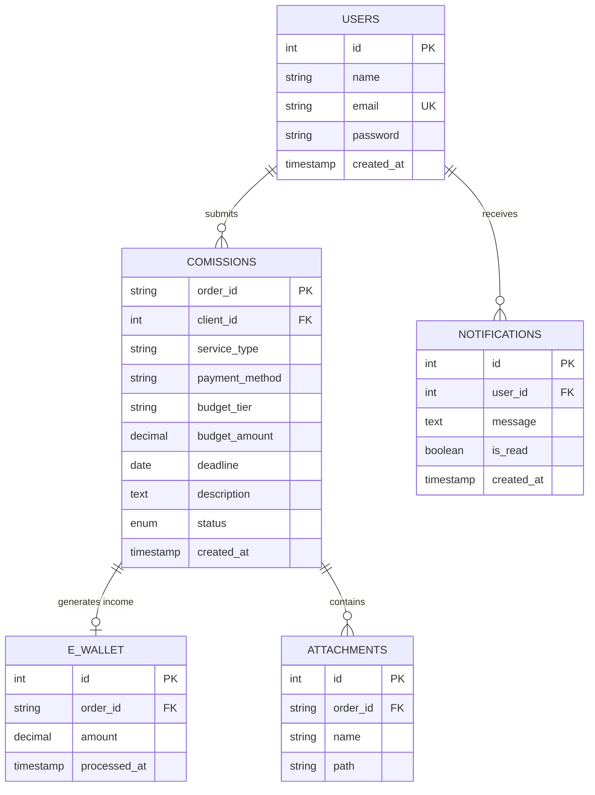

# Database Design: CommissionHub

This document outlines the database architecture for the CommissionHub platform. It includes the Entity Relationship Diagram (ERD), detailed table structures, and relationship definitions to ensure data integrity and scalability.

## 1. Entity Relationship Diagram (ERD)

The diagram below illustrates the entities and their relationships within the system.

---

## 2. Relational Schema

### 2.1 Users Table

Stores account information for both clients and administrators.

| Column       | Type         | Constraints               | Description                            |
| :----------- | :----------- | :------------------------ | :------------------------------------- |
| `id`         | INT          | PK, Auto Increment        | Unique identifier for each user.       |
| `name`       | VARCHAR(100) | NOT NULL                  | Full name of the user.                 |
| `email`      | VARCHAR(100) | UNIQUE, NOT NULL          | User's email address (used for login). |
| `password`   | VARCHAR(255) | NOT NULL                  | Hashed password.                       |
| `created_at` | TIMESTAMP    | DEFAULT CURRENT_TIMESTAMP | Account creation timestamp.            |

### 2.2 Commissions Table

Captures project requests submitted by clients.

| Column           | Type          | Constraints               | Description                               |
| :--------------- | :------------ | :------------------------ | :---------------------------------------- |
| `order_id`       | VARCHAR(50)   | PK                        | Unique alphanumeric ID for the request.   |
| `client_id`      | INT           | FK (users.id)             | Links to the user who made the request.   |
| `service_type`   | VARCHAR(50)   | NOT NULL                  | Type of service (e.g., "Web Design").     |
| `payment_method` | VARCHAR(50)   | NOT NULL                  | Selected payment gateway (e.g., "GCash"). |
| `budget_tier`    | VARCHAR(50)   | NOT NULL                  | Selected tier (e.g., "Silver", "Gold").   |
| `budget_amount`  | DECIMAL(10,2) | NOT NULL                  | Numeric value of the budget.              |
| `deadline`       | DATE          | NULLABLE                  | Target completion date.                   |
| `description`    | TEXT          | NOT NULL                  | Detailed project requirements.            |
| `status`         | ENUM          | 'pending', 'completed'    | Current progress of the request.          |
| `created_at`     | TIMESTAMP     | DEFAULT CURRENT_TIMESTAMP | Submission timestamp.                     |

### 2.3 Notifications Table

Stores alerts and updates for users.

| Column       | Type      | Constraints               | Description                        |
| :----------- | :-------- | :------------------------ | :--------------------------------- |
| `id`         | INT       | PK, Auto Increment        | Unique notification ID.            |
| `user_id`    | INT       | FK (users.id)             | The recipient of the notification. |
| `message`    | TEXT      | NOT NULL                  | Content of the alert.              |
| `is_read`    | BOOLEAN   | DEFAULT 0                 | Tracking for UI read status.       |
| `created_at` | TIMESTAMP | DEFAULT CURRENT_TIMESTAMP | When the alert was sent.           |

### 2.4 E-Wallet (Income History)

Tracks revenue generated from completed commissions.

| Column         | Type          | Constraints               | Description                            |
| :------------- | :------------ | :------------------------ | :------------------------------------- |
| `id`           | INT           | PK, Auto Increment        | Transaction record ID.                 |
| `order_id`     | VARCHAR(50)   | FK (commissions.order_id) | Links to the specific completed order. |
| `amount`       | DECIMAL(10,2) | NOT NULL                  | Revenue amount earned.                 |
| `processed_at` | TIMESTAMP     | DEFAULT CURRENT_TIMESTAMP | When the payment was recorded.         |

### 2.5 Attachments Table (Planned)

Handles file uploads related to project requests.

| Column     | Type         | Constraints               | Description                          |
| :--------- | :----------- | :------------------------ | :----------------------------------- |
| `id`       | INT          | PK, Auto Increment        | Unique file ID.                      |
| `order_id` | VARCHAR(50)  | FK (commissions.order_id) | Links file to a specific commission. |
| `name`     | VARCHAR(255) | NOT NULL                  | Original filename.                   |
| `path`     | VARCHAR(255) | NOT NULL                  | Storage location on the server.      |

---

## 3. Relationships Explained

- **Users to Commissions (1:M)**: A single user can submit multiple commission requests over time, but each request belongs to exactly one user.
- **Users to Notifications (1:M)**: A user can receive many notifications regarding their account or project status.
- **Commissions to E-Wallet (1:1)**: In the current workflow, one completed commission generates exactly one entry in the income history (E-Wallet).
- **Commissions to Attachments (1:M)**: A single commission request may include multiple file uploads (e.g., reference images, assets).

---

---

## 4. Analytics & Reporting Logic

The system utilizes specialized SQL logic to generate administrative reports without requiring additional tables, maintaining a lean schema.

### 5.1 Aggregate Reporting

- **Revenue Tracking**: Uses `SUM(budget_amount)` grouped by `service_type` to monitor high-performing services.
- **Service Popularity**: Uses `COUNT(*)` with `GROUP BY` and `ORDER BY DESC LIMIT 1` to identify trends.
- **Average Ticket Size**: Uses `AVG(budget_amount)` on completed orders to track profitability.

### 5.2 Subquery Optimization

To minimize API requests, complex metrics like **Revenue Share Percentage** are calculated directly in the SQL layer using subqueries:

- **Share Calculation**: `(SUM(amount) / (SELECT SUM(amount) FROM ...)) * 100`

### 5.3 Workload Analysis

- **Pending Summary**: Employs `LEFT JOIN` between `USERS` and `COMISSIONS` with a `HAVING` clause to filter out inactive users, providing a clear view of current client demands.
