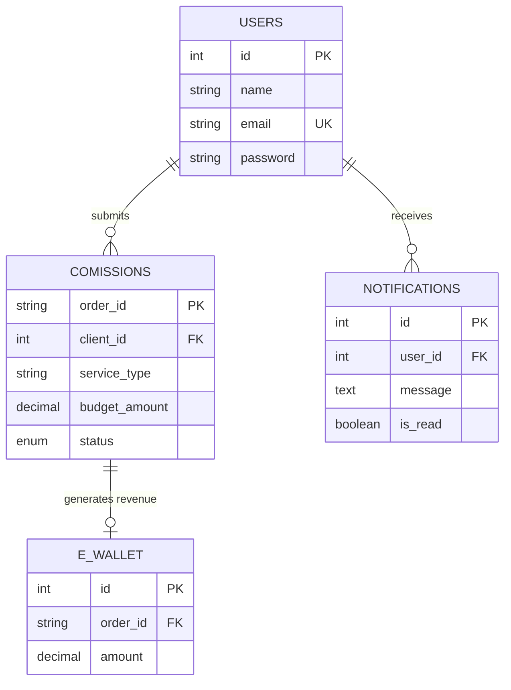

# CommissionHub: Database Schema & Technical Documentation

---

## 🧾 1. Short Introduction

The CommissionHub database is a centralized relational storage system designed to manage service-based commission requests. It allows clients to submit project briefs and track their progress while providing administrators with tools to manage workflows and monitor financial performance. The system manages user authentication, project lifecycle data, real-time alerts, and automated revenue logging.

---

## 🗂️ 2. List of Tables (Overview)

- **Users**: Stores account credentials and profile information for clients and admins.
- **Commissions**: Manages project request details, service types, budgets, and statuses.
- **Notifications**: Stores automated updates and alerts sent to clients.
- **E-Wallet**: Tracks income history and revenue generated from completed projects.
- **Attachments**: (Planned/Optional) Handles file references associated with commission requests.

---

## 🔗 3. Relationships (Explain Connections)

- **One user can have many commissions (1:N)**: A client can submit multiple project requests over time, but each individual request belongs to exactly one user account.
- **One user can receive many notifications (1:N)**: System-generated alerts and updates are sent to specific users, allowing for a personalized communication history.
- **Commissions and E-Wallet have a 1:1 relationship**: Every project marked as "Completed" generates exactly one corresponding entry in the income history (E-Wallet).

---

## 🔐 4. Constraints (Data Integrity)

- **Primary Keys (PK)**: Every table has a unique identifier (`id` or `order_id`) to ensure no two records are identical.
- **Foreign Keys (FK)**: Used to link tables (e.g., `client_id` in Commissions links to `id` in Users).
- **ON DELETE CASCADE**: Applied to all foreign keys to ensure that if a user or commission is deleted, all related notifications or revenue logs are automatically removed.
- **UNIQUE Constraint**: Applied to the `email` field in the Users table to prevent multiple accounts from using the same email address.
- **NOT NULL**: Ensures that critical fields like names, emails, and budget amounts are never left empty during submission.

---

## 📊 5. Table Structures

### 🔹 Table: Users

| Column Name  | Data Type    | Constraints               | Description               |
| :----------- | :----------- | :------------------------ | :------------------------ |
| `id`         | INT          | PK, AUTO_INCREMENT        | Unique user identifier.   |
| `name`       | VARCHAR(100) | NOT NULL                  | User's full display name. |
| `email`      | VARCHAR(100) | UNIQUE, NOT NULL          | User login email.         |
| `password`   | VARCHAR(255) | NOT NULL                  | Hashed security password. |
| `created_at` | TIMESTAMP    | DEFAULT CURRENT_TIMESTAMP | Account creation date.    |

### 🔹 Table: Commissions (`comissions`)

| Column Name      | Data Type     | Constraints               | Description                         |
| :--------------- | :------------ | :------------------------ | :---------------------------------- |
| `order_id`       | VARCHAR(50)   | PK                        | Unique alphanumeric request ID.     |
| `client_id`      | INT           | FK (users.id)             | Links project to a client.          |
| `service_type`   | VARCHAR(50)   | NOT NULL                  | Category of service requested.      |
| `payment_method` | VARCHAR(50)   | NOT NULL                  | Selected payment gateway.           |
| `budget_tier`    | VARCHAR(50)   | NOT NULL                  | Selected service tier (e.g., Gold). |
| `budget_amount`  | DECIMAL(10,2) | NOT NULL                  | Numeric financial value.            |
| `deadline`       | DATE          | NULLABLE                  | Target completion date.             |
| `description`    | TEXT          | NOT NULL                  | Detailed project brief.             |
| `status`         | ENUM          | 'pending', 'completed'    | Current project progress.           |
| `created_at`     | TIMESTAMP     | DEFAULT CURRENT_TIMESTAMP | Submission timestamp.               |

### 🔹 Table: Notifications

| Column Name  | Data Type | Constraints               | Description                 |
| :----------- | :-------- | :------------------------ | :-------------------------- |
| `id`         | INT       | PK, AUTO_INCREMENT        | Unique notification ID.     |
| `user_id`    | INT       | FK (users.id)             | Recipient of the alert.     |
| `message`    | TEXT      | NOT NULL                  | Alert message content.      |
| `is_read`    | BOOLEAN   | DEFAULT 0                 | Read/Unread status tracker. |
| `created_at` | TIMESTAMP | DEFAULT CURRENT_TIMESTAMP | Date the alert was sent.    |

### 🔹 Table: E-Wallet (`e-wallet`)

| Column Name    | Data Type     | Constraints               | Description                      |
| :------------- | :------------ | :------------------------ | :------------------------------- |
| `id`           | INT           | PK, AUTO_INCREMENT        | Transaction record ID.           |
| `order_id`     | VARCHAR(50)   | FK (comissions.order_id)  | Link to completed commission.    |
| `amount`       | DECIMAL(10,2) | NOT NULL                  | Revenue earned from the project. |
| `processed_at` | TIMESTAMP     | DEFAULT CURRENT_TIMESTAMP | Date of income processing.       |

---

## 🧩 6. ER Diagram



---

## ⚙️ 7. SQL Code

```sql
-- Create Users Table
CREATE TABLE users (
    id INT AUTO_INCREMENT PRIMARY KEY,
    name VARCHAR(100) NOT NULL,
    email VARCHAR(100) UNIQUE NOT NULL,
    password VARCHAR(255) NOT NULL,
    created_at TIMESTAMP DEFAULT CURRENT_TIMESTAMP
);

-- Create Commissions Table
CREATE TABLE comissions (
    order_id VARCHAR(50) PRIMARY KEY,
    client_id INT,
    service_type VARCHAR(50) NOT NULL,
    payment_method VARCHAR(50),
    budget_tier VARCHAR(50),
    budget_amount DECIMAL(10,2) NOT NULL,
    deadline DATE,
    description TEXT,
    status ENUM('pending', 'completed') DEFAULT 'pending',
    created_at TIMESTAMP DEFAULT CURRENT_TIMESTAMP,
    FOREIGN KEY (client_id) REFERENCES users(id) ON DELETE CASCADE
);

-- Create Notifications Table
CREATE TABLE notifications (
    id INT AUTO_INCREMENT PRIMARY KEY,
    user_id INT,
    message TEXT NOT NULL,
    is_read BOOLEAN DEFAULT 0,
    created_at TIMESTAMP DEFAULT CURRENT_TIMESTAMP,
    FOREIGN KEY (user_id) REFERENCES users(id) ON DELETE CASCADE
);

-- Create E-Wallet Table
CREATE TABLE `e-wallet` (
    id INT AUTO_INCREMENT PRIMARY KEY,
    order_id VARCHAR(50),
    amount DECIMAL(10,2) NOT NULL,
    processed_at TIMESTAMP DEFAULT CURRENT_TIMESTAMP,
    FOREIGN KEY (order_id) REFERENCES comissions(order_id) ON DELETE CASCADE
);
```
